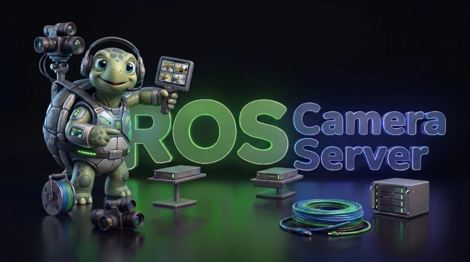

# ROS Camera Server

**ROS Camera Server** is a ROS 2 camera streaming hub that ingests video from multiple sources, transcodes it via GStreamer, and distributes it to multiple outputs - optimized for low latency and compute efficiency.
This enables you to simultaneously stream your cameras to ROS and encoded to your operator station significantly reducing latency by skipping the typical first ROS - then encoded stream flow.

## ✨ Features

* 📷 **Multiple Input Sources**: V4L2 cameras, ROS 2 image topics, SeekThermal thermal cameras, RTP/UDP (H.264/H.265/JPEG)
* 📡 **Multiple Output Targets**: SRT streams (H.264/H.265), ROS 2 image topics, WebRTC (H.264/H.265), RTP (UDP, H.264/H.265/JPEG/raw)
* ⚡ **Efficient Pipeline**: Shared encoder instances across multiple outputs via a pipeline graph that deduplicates processing stages
* 🕐 **Latency Tracking**: End-to-end pipeline latency and embedded capture timestamps in custom RTP header extensions
* 🔁 **Automatic Recovery**: Periodic health checks detect and repair failed pipelines
* 🎮 **Hardware Acceleration**: Automatically uses NVIDIA NVENC, VA-API, or Rockchip MPP encoders when available, falling back to software encoding transparently
* 🛠️ **YAML Configuration**: All cameras, inputs, and outputs are declared in a single config file


## 🛠️ Building from Source

1. **Create a ROS 2 workspace** (if you haven't already):
   ```bash
   mkdir -p ~/ros2_ws/src
   cd ~/ros2_ws/src
   ```

2. **Clone the repository and install dependencies**:
   ```bash
   git clone https://github.com/StefanFabian/ros_camera_server.git
   git clone https://github.com/StefanFabian/gstreamer_ros_babel_fish.git
   rosdep install --from-paths . --ignore-src -r -y
   ```

   [`gstreamer_ros_babel_fish`](https://github.com/StefanFabian/gstreamer_ros_babel_fish) is used to bridge GStreamer pipelines with arbitrary ROS 2 message types.


3. **Build the workspace and source again to register new packages**:
   ```bash
   cd ~/ros2_ws
   colcon build --symlink-install --packages-up-to ros_camera_server
   source install/setup.bash
   ```

> [!NOTE]
> Hardware acceleration may require additional packages to be available.

## 🚀 Usage

> [!TIP]
> New here? See [QUICKSTART.md](QUICKSTART.md) for a step-by-step walkthrough: discover cameras, find supported resolutions/framerates, and write your first config.

Start the server:

```bash
ros2 launch ros_camera_server server.launch.yaml
```

By default it loads the example config `config/config.yaml`. Pass a custom config with:

```bash
ros2 launch ros_camera_server server.launch.yaml config_path:=/path/to/your/config.yaml
```

## ⚙️ Configuration

Cameras are configured in a YAML file. Each camera has one input and one or more outputs:

```yaml
robot: "my_robot"
address: "192.168.1.100"   # Address advertised to clients in stream URIs
signaling_port: 8443 # For webrtc outputs, the port of the signaling server
cameras:
  front_camera:
    name: "Front Camera"
    input:
      type: v4l2
      device: "/dev/video0"
      width: 1920
      height: 1080
      framerate: "30/1"
    outputs:
      - type: srt
        codec: h265
        port: 7100
        bitrate: 800        # in kbps
        width: 1920
        height: 1080
        framerate: "30/1"
      - type: ros2
        topic: "/camera_server/front"
        frame_id: "front_camera_optical_frame"
        codec: auto # Will automatically choose compressed or raw based on the cameras available codecs
        # Optional: publish CameraInfo on the standard sibling topic, e.g. /camera_server/camera_info
        # camera_info_url: "file:///home/user/.ros/camera_info/front_camera.yaml"
```

See [ros_camera_server/config/config.yaml](ros_camera_server/config/config.yaml) for a full example with all options documented.

### 📷 Inputs

Supported input types: **V4L2**, **ROS 2 image topics**, **RTP**, **SeekThermal**. See [INPUTS.md](INPUTS.md) for the full reference.

### 📡 Outputs

Supported output types: **ROS 2 image topics**, **RTP** (H.264/H.265), **SRT** (H.264/H.265), **WebRTC** (H.264/H.265). See [OUTPUTS.md](OUTPUTS.md) for the full reference.

## 🎬 Viewing an SRT Stream

```bash
# H.265
gst-launch-1.0 -v srtsrc uri=srt://127.0.0.1:7100 ! application/x-rtp ! rtph265depay ! h265parse ! decodebin ! queue max-size-buffers=1 leaky=downstream ! videoconvert ! autovideosink sync=false

# H.264
gst-launch-1.0 -v srtsrc uri=srt://127.0.0.1:7101 ! application/x-rtp ! rtph264depay ! h264parse ! decodebin ! queue max-size-buffers=1 leaky=downstream ! videoconvert ! autovideosink sync=false
```

These should work with the provided default config if you have a default video device (e.g. a webcam).

## 🔧 Bundled Tools

| Tool | Description |
|------|-------------|
| `ros2 run ros_camera_server v4l2_caps_investigator` | Lists supported resolutions, formats, and framerates for a V4L2 device |
| `ros2 run ros_camera_server v4l2_controls_inspector` | Lists available V4L2 controls and their value ranges |
| `ros2 run ros_camera_server enumerate_encoders` | Lists available GStreamer encoders and tests the maximum number of concurrent streams |


## 📄 License

This project is licensed under the **AGPL-3.0-only** License.
If you require a different license, please contact me through my website.
